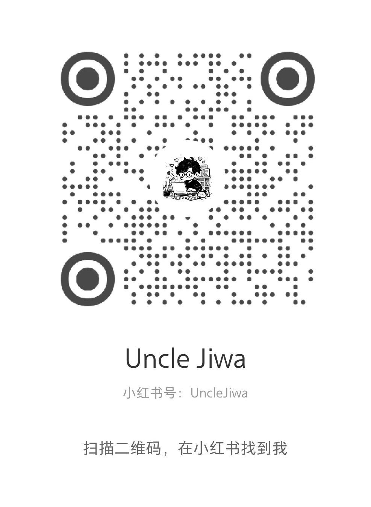

  

  

## 🧙 About Me

- 🔭 中登前端，正在绝地自救
- 🤖 前端 × AI 双修，喜欢折腾好玩的东西
- 🌱 永远在学新东西的路上

## ⚔️ 技术栈

  

## 📊 GitHub 统计

  
  

  

## 🐍 贪吃蛇

  <picture>
    <source media="(prefers-color-scheme: dark)" srcset="https://raw.githubusercontent.com/liuguangsen0409/liuguangsen0409/output/github-contribution-grid-snake-dark.svg" />
    <source media="(prefers-color-scheme: light)" srcset="https://raw.githubusercontent.com/liuguangsen0409/liuguangsen0409/output/github-contribution-grid-snake.svg" />
    
  </picture>

## 📮 找到我

  

  <table>
    <tr>
      <td align="center">
        
         
        <b>公众号 · Uncle Jiwa</b>
      </td>
      <td align="center">
        
         
        <b>小红书 · Uncle Jiwa</b>
      </td>
    </tr>
  </table>

  

